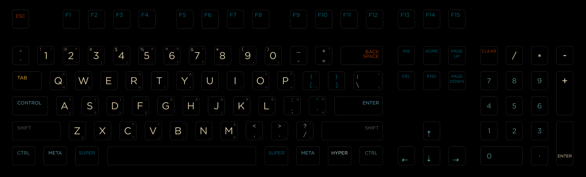
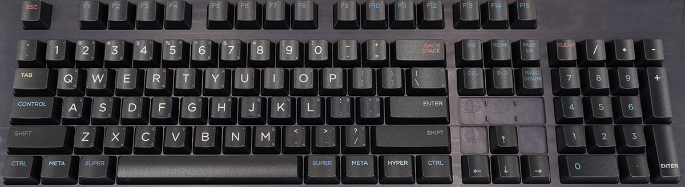

# Darktooth WASD Keyboard layout design

This is a keyboard layout based on my Emacs theme, Darktooth.

Layout is Mac / ANSI. (Super = Cmd, Meta = Alt)

# License

Permissive BSD license.

# Usage

Intended to be used with http://wasdkeyboards.com v2 keyboard / keycaps design tool. (upload the SVG.) add in the comments to make sure they don't print the bg layer.

# Previews

### WASD Pre-print preview

